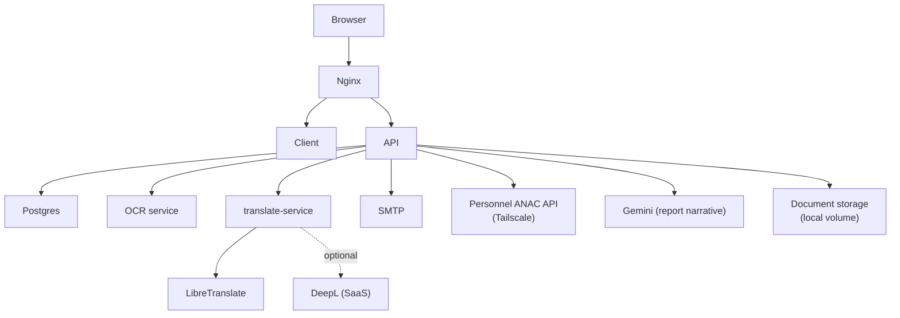

# SICOT - Runtime Topology

How the components described in [overview.md](./overview.md) are actually
wired together in each supported tier. Every fact below is derived from the
compose/nginx/workflow/config files cited inline - if a file changes, this
document is stale until updated to match it.

## Development

Two supported ways to run dev exist **side by side** in this repository -
this is not a case of stale docs vs. real code; both are real:

1. **Native**: `npm run dev` at the repo root
   ([`package.json`](../../package.json)) runs the server (`tsx watch`) and
   client (Vite) directly on the host. `packages/ocr-service` and
   `packages/translate-service` are run separately (`npm run services:up`
   proxies to `docker compose up -d libretranslate translate-service
ocr-service`), or installed natively per `README.md`.
2. **Docker Compose**: [`docker-compose.yml`](../../docker-compose.yml),
   project name `sicot`.

| Service             | Image / build                                    | Port                                         | Notes                                                                                                      |
| ------------------- | ------------------------------------------------ | -------------------------------------------- | ---------------------------------------------------------------------------------------------------------- |
| `postgres`          | `postgres:16`                                    | `5432:5432` (host-exposed for local DB GUIs) |                                                                                                            |
| `libretranslate`    | `libretranslate/libretranslate:latest`           | `5000:5000`                                  |                                                                                                            |
| `translate-service` | build `packages/translate-service/Dockerfile`    | `5002:5002`                                  | depends on `libretranslate`                                                                                |
| `ocr-service`       | build `packages/ocr-service/Dockerfile`          | `5001:5001`                                  |                                                                                                            |
| `api`               | build `packages/server/Dockerfile`, target `dev` | `3001:3001`                                  | depends on `postgres` (healthy), `ocr-service`, `translate-service`; runs `db:migrate` then `dev` on start |
| `client`            | build `packages/client/Dockerfile`, target `dev` | `5173:5173`                                  | depends on `api`                                                                                           |

No reverse proxy in dev - every service's port is exposed directly on
`localhost`. Volumes: `postgres_dev_data`, `libretranslate_dev_data`,
`sicot_uploads` (mounted at `/sicot/documents` in `api`).

**Server** listens on `process.env.PORT ?? 3001`
([`packages/server/src/index.ts`](../../packages/server/src/index.ts)); CORS
origin defaults to `http://localhost:5173`. **Client** dev server runs on
port 5173 ([`packages/client/vite.config.ts`](../../packages/client/vite.config.ts)).

OCR and translation calls from the server are HTTP, not in-process:
`OCR_SERVICE_URL` (default `http://localhost:5001`,
[`utils/ocr.ts`](../../packages/server/src/utils/ocr.ts)) and
`TRANSLATE_SERVICE_URL` (default `http://localhost:5002`,
[`utils/traduction.ts`](../../packages/server/src/utils/traduction.ts)).

## Staging

[`docker-compose.staging.yml`](../../docker-compose.staging.yml), project
name `sicot_staging`, isolated on its own `staging_net` bridge network,
launched via [`scripts/deploy-staging.sh`](../../scripts/deploy-staging.sh)
(builds all images **locally** - never pulls from GHCR).

| Service                  | Build target                                    | Port exposed to host                   | Health-gated on                                                |
| ------------------------ | ----------------------------------------------- | -------------------------------------- | -------------------------------------------------------------- |
| `postgres_staging`       | `postgres:16`                                   | none                                   | -                                                              |
| `libretranslate_staging` | image                                           | none                                   | -                                                              |
| `translate_staging`      | `Dockerfile`, same as dev                       | none                                   | `libretranslate_staging` healthy                               |
| `ocr_staging`            | `Dockerfile`, same as dev                       | none                                   | -                                                              |
| `api_staging`            | `packages/server/Dockerfile`, target **`prod`** | none                                   | `postgres_staging`, `ocr_staging`, `translate_staging` healthy |
| `client_staging`         | `packages/client/Dockerfile`, target **`prod`** | none                                   | -                                                              |
| `nginx_staging`          | `nginx:alpine`                                  | **`4001:80`** (only host-exposed port) | `api_staging`, `client_staging` healthy                        |

**No TLS in staging** - [`nginx/staging.conf`](../../nginx/staging.conf) is
plain HTTP, routing `/api/` and `/uploads/` to `api_staging:3001` and
everything else to `client_staging:80`.

This tier exists specifically to prove the _production_ Docker images (`prod`
build targets) work before publishing them - `api_staging`/`client_staging`
use the same target as production, not the `dev` target.

## Production

[`docker-compose.prod.yml`](../../docker-compose.prod.yml), project name
`sicot_prod`, on a `prod_net` bridge network. **Pulls prebuilt images from
GHCR** rather than building locally.

| Service          | Image                                       | Port exposed to host                           | Health-gated on                        |
| ---------------- | ------------------------------------------- | ---------------------------------------------- | -------------------------------------- |
| `postgres`       | `postgres:16`                               | none                                           | -                                      |
| `libretranslate` | image                                       | none                                           | -                                      |
| `translate`      | `ghcr.io/<owner>/sicot-translate:<version>` | none                                           | `libretranslate` healthy               |
| `ocr`            | `ghcr.io/<owner>/sicot-ocr:<version>`       | none                                           | -                                      |
| `api`            | `ghcr.io/<owner>/sicot-api:<version>`       | none                                           | `postgres`, `ocr`, `translate` healthy |
| `client`         | `ghcr.io/<owner>/sicot-client:<version>`    | none                                           | -                                      |
| `nginx`          | `nginx:alpine`                              | **`80:80`, `443:443`** (only public container) | `api`, `client` healthy                |

**TLS termination** happens in `nginx` via Let's Encrypt certs
([`nginx/prod.conf`](../../nginx/prod.conf)): port 80 does an HTTP→HTTPS
redirect (plus ACME challenge passthrough), port 443 terminates TLS and
routes `/` to `client`, `/api/` and `/uploads/` to `api:3001`.

**Deployment pipeline:**

1. [`.github/workflows/docker-publish.yml`](../../.github/workflows/docker-publish.yml)
   builds and pushes 4 images to GHCR on push to `main` (each with `target: prod`).
2. [`.github/workflows/deploy-prod.yml`](../../.github/workflows/deploy-prod.yml)
   is **`workflow_dispatch`-only** (never automatic), gated behind a GitHub
   `production` **Environment** (supports a required-reviewer manual
   approval, if configured in repo settings). It SSHes into the target host
   and runs [`scripts/deploy-prod.sh`](../../scripts/deploy-prod.sh), which
   pulls the images, runs migrations in a throwaway container, then
   `up -d --remove-orphans`.

### Repository-defined topology vs. confirmed live infrastructure

Everything above is what the **repository defines** for production. It is
**not** confirmation that a live production VPS currently exists and is
running this stack - the repository contains no evidence of that (no
recorded deployed SHA, no IaC state, no live-infrastructure inventory). Treat
"production topology" and "a live production deployment exists" as two
separate claims; only the first is backed by files in this repo.

## Unknown / manual prerequisites

These are real gaps in what the repository can prove, not architecture
defects - recorded here so they aren't silently assumed away:

- The real production domain is not in the repository - `nginx/prod.conf`
  and `.env.prod.example` both use a literal `PLACEHOLDER-DOMAIN.com`.
- VPS provisioning is not codified (no Terraform/Ansible/other IaC) - it's a
  manual checklist in operational docs, not automated.
- Certbot/TLS issuance is a manual, host-level step - not containerized, not
  a compose service.
- The Personnel ANAC integration requires the production host to be joined
  to a specific Tailscale network - a manual prerequisite, not something any
  script in this repo automates.
- Whether a production VPS is actually provisioned and live today cannot be
  confirmed from repository contents alone.

## Service dependency diagram

Production tier shown - the tier with the most components. Only edges that
exist in this codebase are drawn (no inbound webhooks; every microservice
call is outbound from `api`).

Dev and staging use the same shape minus the reverse proxy in dev (services
are reached directly by port) and minus TLS in staging.
